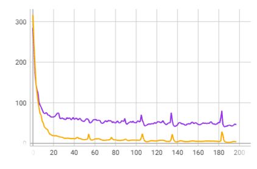

# HomographyNet
**Implement of homography net by pytorch**  

---

## Brief Introduction
This project is based on the work Homography-Net:
```
@article{detone2016deep,
  title={Deep image homography estimation},
  author={DeTone, Daniel and Malisiewicz, Tomasz and Rabinovich, Andrew},
  journal={arXiv preprint arXiv:1606.03798},
  year={2016}
}     
```
## Dependencies
- OpenCV
- pytroch 1.8.1
- numpy
- pandas
- tqdm
- PIL
---

## Running the code

Before you run the code,onfirm all options and parameters needed.
```
python generate_dataset.py -h
```
```
python train.py -h
```
```
python test.py -h
```
## Generate dataset
```
python generate_dataset.py
```
## Training
```
python train.py
```
## Testing
```
python test.py
```
## pretrained_model
I also submited a pretrained model which was trained on a generated satellite dataset contained 20535 128*128-size images.

>saved_model.skpt



